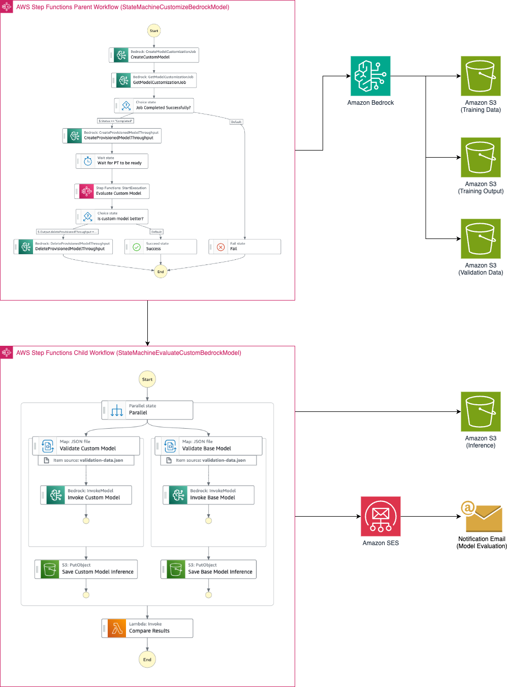
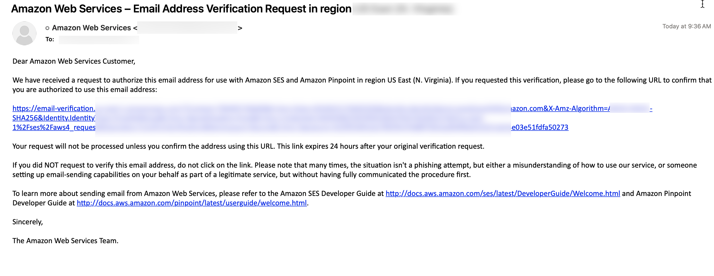
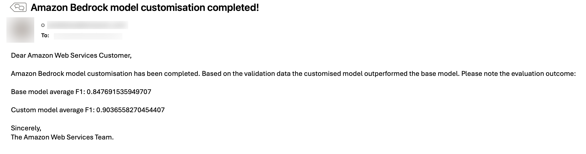

# Automating model customization in Amazon Bedrock with AWS Step Functions workflow

The AWS Step Functions Workflow can be started using the AWS CLI or from another service (e.g. Amazon API Gateway).

The SAM template deploys an AWS Step Functions workflow that creates custom model by fine tuning a foundation model. It then creates a provisioned throughput with that custom model. Next it evaluates the performance of the custom model with respect to the base model. Text summarization using Amazon Bedrock Cohere Command Light model is taken as an use case. However, the framework can be extended to fine tune other models. The SAM template contains the required resources with IAM permission to run the application.

Important: this application uses various AWS services and there are costs associated with these services after the Free Tier usage - please see the [AWS Pricing page](https://aws.amazon.com/pricing/) for details. You are responsible for any AWS costs incurred. No warranty is implied in this example.

## Requirements

* [Create an AWS account](https://portal.aws.amazon.com/gp/aws/developer/registration/index.html) if you do not already have one and log in. The IAM user that you use must have sufficient permissions to make necessary AWS service calls and manage AWS resources.
* [AWS CLI](https://docs.aws.amazon.com/cli/latest/userguide/install-cliv2.html) installed and configured
* [Git Installed](https://git-scm.com/book/en/v2/Getting-Started-Installing-Git)
* [AWS Serverless Application Model](https://docs.aws.amazon.com/serverless-application-model/latest/developerguide/serverless-sam-cli-install.html) (AWS SAM) installed
* You must enable the Amazon Bedrock Cohere Command Light Model access in the Amazon Bedrock console in the region where you are going to run the SAM template.
* [Docker](https://docs.aws.amazon.com/serverless-application-model/latest/developerguide/install-docker.html) must be installed and running.

## Deployment Instructions

1. Create a new directory, navigate to that directory in a terminal and clone the GitHub repository:
    ``` 
    git clone https://github.com/biswanathmukherjee/stepfunctions-bedrock-model-customization-sam.git
    ```

2. Change directory to the pattern directory:
    ```
    cd stepfunctions-bedrock-model-customization-sam
    ```

3. Run the `build.sh` to create the container image.
    ```
    bash build.sh
    ```

    When asked enter the parameter values. Here are the sample values:
    ```
    image_name=model-evaluation
    repo_name=bedrock-model-customization
    aws_account={your-AWS-account-id}
    aws_region={your-region}
    ```

4. From the command line, use AWS SAM to deploy the AWS resources for the pattern as specified in the template.yml file:
    ```
    sam deploy --guided
    ```

5. During the prompts:
    * Enter a stack name
    * Enter `us-east-1` AWS Region or any other region where Amazon Bedrock and the required foundation model is available.
    * Enter `SenderEmailId` - Once the model customization is complete email will come from this email id. You need to have access to this mail id to verify the ownership.
    * Enter `RecipientEmailId` - User will be notified to this email id.
    * Enter `ContainerImageURI` - ContainerImageURI is available from the output of the `bash build.sh` step.
    * Allow SAM CLI to create IAM roles with the required permissions.

6. Note the outputs from the SAM deployment process. These contain the resource names and/or ARNs which are used for testing.

## How it works

* Upload the training data in JSON Line format into the Amazon S3 training data bucket.
* Upload the validation data and reference inference in JSON Line format into the Amazon S3 validation data bucket.
* Start the AWS Step Functions Workflow using the `start-execution` api command with the input payload in JSON format. 
* The workflow invokes Amazon Bedrock's `CreateModelCustomizationJob` API to fine tune the base model with the traing data from the Amazon S3 bucket and the passed in hyper parameters.
* The workflow periodically checks for the status of the `CreateModelCustomizationJob`.
* Once the custom model is created, the workflow invokes Amazon Bedrock's `CreateProvisionedModelThroughput` API to create a Provisioned Throughput with no commitment.
* The state machine calls the child statemachine to evaluate the performance of the custom model with respect to the base model. 
* The child state machine invokes the base model and the customized model provisioned throughput with the same validation data from the Amazon S3 validation bucket and stores the inference into inference bucket.
* An AWS Lambda function is called to evaluate the quality of the summarization done by custom model and the base model based on BERT score. If the custom model performs poorly than base model, the provisioned throughput is deleted. 
* A notification email is sent with the outcome. 

Please refer to the architecture diagram below:




## Testing

1. Upload the provided training data files to the Amazon S3 bucket using the following command. Please replace `TrainingDataBucket` with the value from the `sam deploy --guided` output. Also please replace `training-data.jsonl` with the desired file name. Also, please update `your-region` with the region that you provided while running the SAM template.

   ```bash
   aws s3 cp {training-data.jsonl} s3://{TrainingDataBucket}/{training-data.jsonl} --region {your-region}
   ```

2. Upload the `validation-data.json` file to the Amazon S3 bucket using the following command. Please replace `ValidationDataBucket` with the value from the `sam deploy --guided` output. Also, please update `your-region` with the region that you provided while running the SAM template.

   ```bash
   aws s3 cp validation-data.json s3://{ValidationDataBucket}/validation-data.json --region {your-region}
   ```

3. Upload the `reference-inference.json` file to the Amazon S3 bucket using the following command. Please replace `ValidationDataBucket` with the value from the `sam deploy --guided` output. Also, please update `your-region` with the region that you provided while running the SAM template.

   ```bash
   aws s3 cp reference-inference.json s3://{ValidationDataBucket}/reference-inference.json --region {your-region}
   ```

4. You should have also received an email for verification of the sender email id. Please verify the email id following instruction given on the email.




5. Run the following AWS CLI command to start the Step Functions workflow. Please replace `StateMachineCustomizeBedrockModelArn` and `TrainingDataBucket` with the values from the `sam deploy --guided` output. Please replace `UniqueModelName`, `UniqueJobName` with unique values. Please change the values of the hyper parameters based on the selected model. Also, please update `your-region` with the region that you provided while running the SAM template.

    ```bash
    aws stepfunctions start-execution --state-machine-arn "{StateMachineCustomizeBedrockModelArn}" --input "{\"BaseModelIdentifier\": \"cohere.command-light-text-v14:7:4k\",\"CustomModelName\": \"{UniqueModelName}\",\"JobName\": \"{UniqueJobName}\",   \"HyperParameters\": {\"evalPercentage\": \"20.0\", \"epochCount\": \"1\", \"batchSize\": \"8\", \"earlyStoppingPatience\": \"6\", \"earlyStoppingThreshold\": \"0.01\", \"learningRate\": \"0.00001\"},\"TrainingDataFileName\": \"{training-data.jsonl}\"}" --region {your-region}
    ```

    #### Example output:

    ```bash
    {
        "executionArn": "arn:aws:states:{your-region}:123456789012:execution:{stack-name}-wcq9oavUCuDH:2827xxxx-xxxx-xxxx-xxxx-xxxx6e369948",
        "startDate": "2024-01-28T08:00:26.030000+05:30"
    }
    ```
    
    Please note the foundation model customization and evaluation may take 1 hour to 1.5 hour to complete! You will get a notification email once the customization is done. 

5. Run the following AWS CLI command to check the Step Functions workflow status or Log into [AWS Step Functions Cosole](https://console.aws.amazon.com/states/home) to check the execution status. Wait until the workflow completes successfully. Please replace the `executionArn` from previous step output and also `your-region`.
    ```bash
    aws stepfunctions describe-execution --execution-arn {executionArn} --query status --region {your-region}
    ```

6. Once the AWS Step Functions workflow completes successfully, you will receive an email with the outcome of the quality of the customized model. If the customized model is not performing better than the base model, the provisioned throughput will be deleted. 




7. If the quality of the inference response is not satisfactory, you will need to retrain the base model based on the updated training data or hyper parameters.


## Cleanup
 
1. Delete the Amazon Bedrock provisioned throughput of the custom mode. Please *ensure* that the correct `ProvisionedModelArn` is provided to avoid accidental unwanted delete:
   ```bash
   aws bedrock delete-provisioned-model-throughput --provisioned-model-id {ProvisionedModelArn} --region {your-region}
   ``` 

2. Delete the Amazon Bedrock custom model. Please *ensure* that the correct `CustomModelName` is provided to avoid accidental unwanted delete:
   ```bash
   aws bedrock delete-custom-model --model-identifier {CustomModelName} --region {your-region}
   ``` 

3. Delete the content in the Amazon S3 bucket using the following command. Please *ensure* that the correct bucket name is provided to avoid accidental data loss:
   ```bash
   aws s3 rm s3://{TrainingDataBucket} --recursive --region {your-region}
   aws s3 rm s3://{CustomizationOutputBucket} --recursive --region {your-region}
   aws s3 rm s3://{ValidationDataBucket} --recursive --region {your-region}
   aws s3 rm s3://{ModelInferenceBucket} --recursive --region {your-region}
   ```

4. To delete the resources deployed to your AWS account via AWS SAM, run the following command:
   ```bash
   sam delete
   ```

## License

This library is licensed under the MIT-0 License. See the LICENSE file.

